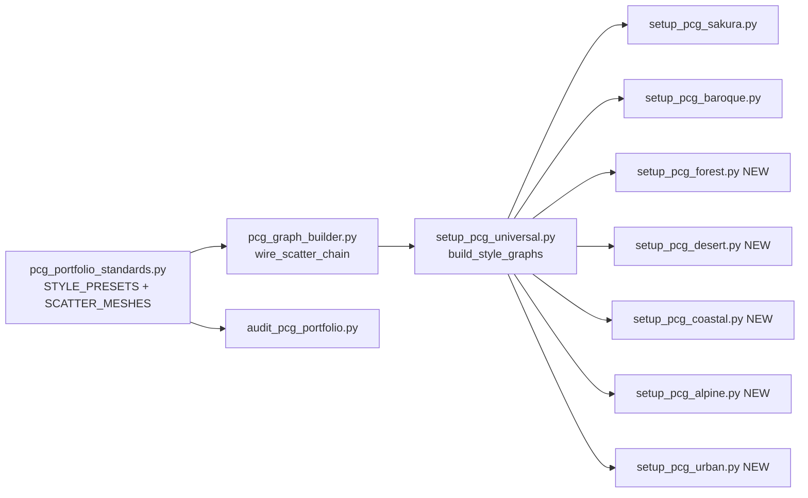

# Requirements

### Overview & Goals

Expand the existing PCG scatter system from its current Sakura/Baroque/Greybox focus into a **universal environment portfolio** capable of powering multiple biome styles (e.g. forest, desert, coastal, alpine, urban ruins) through the same `wire_scatter_chain` architecture.

### Current State Summary

**Working infrastructure:**
- 14 volume-based graphs generate successfully from a plain PCG volume
- ~13 spline-based Bezier graphs work but need a spline actor input
- ~13 `*Ex` graphs are blocked by an empty `PCG_Sub_BaroqueSpawn` subgraph
- `wire_scatter_chain` in `pcg_graph_builder.py` is the canonical scatter pipeline
- `pcg_portfolio_standards.py` defines paths, tags, presets, ISM bands, seeds, and `STYLE_PRESETS`
- Style wrappers exist for Sakura (`setup_pcg_sakura.py`) and Baroque (`setup_pcg_baroque.py`, Phase 3 stub)
- Greybox presets (minimal/standard/showcase) parameterize density/voxel/exclusion
- All scatter meshes are placeholder engine shapes + `Greybox_Kit` cubes

**Gaps:**
- Only 2 style wrappers (Sakura, Baroque-stub); no forest, desert, coastal, alpine, or urban biomes
- `PCG_Sub_BaroqueSpawn` is empty — blocks 13 architectural graphs
- `PCG_WallDetail` is a stub (0 nodes)
- Spline-based graphs have no standard spline-provider pattern
- `SCATTER_MESHES` uses only placeholder geometry
- No biome-switching mechanism to swap style presets per-level
- `L_VFX_Showcase` listed in `SHIPPING_LEVELS` but missing

### Scope

**In Scope:**
- Unblock the 13 `*Ex` graphs by filling `PCG_Sub_BaroqueSpawn`
- Create a spline-provider pattern that revives the 12 Bezier graphs
- Add new biome style presets to `STYLE_PRESETS` (forest, desert, coastal, alpine, urban)
- Add corresponding `setup_pcg_<biome>.py` wrapper scripts
- Expand `SCATTER_MESHES` role dictionary with biome-specific mesh lists
- Implement `PCG_WallDetail` as a functional spline-tagged wall scatter
- Add biome-level wiring helpers to apply a full biome preset to a level
- Update audits and validation to cover new biomes

**Out of Scope:**
- Production art meshes (stays placeholder/greybox)
- Landscape terrain sculpting
- Material creation (MPA domain)
- PCGEx plugin C++ modifications
- Blender geometry generation (PGA domain)

# Technical Design

### Architecture

The expansion follows the existing pattern: `pcg_portfolio_standards.py` is the single source of truth, `pcg_graph_builder.py` provides the shared `wire_scatter_chain` builder, and thin `setup_pcg_<style>.py` wrappers parameterize per-biome.

### Key Decisions

1. **Same `wire_scatter_chain` for all biomes** — no new graph builder; biomes differ only in preset parameters (density, voxel, meshes, materials, scale, jitter). This keeps the architecture flat and testable.
2. **Biome = STYLE_PRESET entries + scatter mesh roles + wrapper script** — each biome adds 3–5 entries to `STYLE_PRESETS` (e.g. `forest_canopy`, `forest_undergrowth`, `forest_deadwood`) and corresponding mesh role lists.
3. **Spline provider pattern** — a shared `setup_pcg_spline_provider()` helper in `pcg_graph_builder.py` that spawns a tagged spline actor, reviving all 12 Bezier graphs with one pattern.
4. **Fill `PCG_Sub_BaroqueSpawn`** — wire a minimal volume-sampler → spawner chain using existing Baroque collection meshes, unblocking 13 `*Ex` graphs.

### Proposed Changes

#### `pcg_portfolio_standards.py`
- Add `SCATTER_MESHES` roles: `canopy`, `undergrowth`, `deadwood`, `cactus`, `dune_grass`, `driftwood`, `kelp`, `alpine_shrub`, `snow_debris`, `rubble`, `ivy`
- Add `STYLE_PRESETS` entries for each biome (3–5 layers per biome)
- Add `DIR_STYLES` subdirectories: `Forest`, `Desert`, `Coastal`, `Alpine`, `Urban`
- Add `GRAPH_*` constants for new biome graphs
- Add `PCG_PYTHON_OWNERS` entries
- Add `ALL_PORTFOLIO_DIRS` entries
- Add seed constants: `SEED_CANOPY`, `SEED_UNDERGROWTH`, etc.

#### `pcg_graph_builder.py`
- Add `setup_spline_provider(level, tag, points)` — spawns a spline actor with `PCG_Spline` tag
- Add `fill_baroque_spawn_subgraph(force)` — wires `PCG_Sub_BaroqueSpawn` with volume-sampler → spawner
- Add `build_wall_detail(force)` — implements `PCG_WallDetail` as spline-tagged wall scatter

#### New files: `setup_pcg_forest.py`, `setup_pcg_desert.py`, `setup_pcg_coastal.py`, `setup_pcg_alpine.py`, `setup_pcg_urban.py`
- Each follows the `setup_pcg_sakura.py` pattern: imports standards + builder, calls `build_style_graphs` for its preset keys, optionally builds a kit from Melodia salvage

#### `setup_pcg_universal.py`
- `build_all()` extended to include new biome style graphs via `build_style_graphs()`
- `build_wall_detail()` call added

#### `audit_pcg_portfolio.py` / `audit_pcg_universal.py`
- Inventory checks expanded to cover new biome graph paths
- Dead-system checks updated for new style directories

### Risks

- **Placeholder meshes** — all new biomes will use engine basic shapes until art meshes are imported; visual quality is greybox-only
- **Editor OOM** — generating many dense biome graphs simultaneously can crash; batch in small groups per PCG_CATALOG gotcha #4
- **PCGEx availability** — exclusion falloff depends on `PCGExDistanceFilterProviderSettings`; fallback passthrough already exists

# Delivery Steps

###   Step 1: Unblock existing dead graphs
All 13 `*Ex` graphs and 12 Bezier graphs become functional.

- Fill `PCG_Sub_BaroqueSpawn` subgraph in `pcg_graph_builder.py` with a volume-sampler → transform → spawner chain using Baroque collection meshes
- Add `setup_spline_provider()` helper to `pcg_graph_builder.py` that spawns a tagged spline actor for Bezier graph input
- Implement `PCG_WallDetail` graph (currently 0 nodes) as a spline-tagged wall scatter chain
- Update `setup_pcg_universal.py` to call `fill_baroque_spawn_subgraph()` and `build_wall_detail()` during `build_all()`

###   Step 2: Expand standards with biome presets and mesh roles
`pcg_portfolio_standards.py` contains all constants, presets, and mesh roles for 5 new biomes.

- Add `SCATTER_MESHES` roles: `canopy`, `undergrowth`, `deadwood`, `cactus`, `dune_grass`, `driftwood`, `kelp`, `alpine_shrub`, `snow_debris`, `rubble`, `ivy`
- Add `STYLE_PRESETS` entries for Forest (canopy, undergrowth, deadwood), Desert (cactus, dune_grass), Coastal (driftwood, kelp), Alpine (alpine_shrub, snow_debris), Urban (rubble, ivy)
- Add directory constants (`DIR_STYLES` subdirs), graph path constants, seed constants, and `ALL_PORTFOLIO_DIRS` entries
- Add `PCG_PYTHON_OWNERS` mappings for all new graphs

###   Step 3: Create biome wrapper scripts
Five new `setup_pcg_<biome>.py` scripts exist, each following the `setup_pcg_sakura.py` pattern.

- Create `setup_pcg_forest.py` — builds forest canopy, undergrowth, and deadwood scatter layers
- Create `setup_pcg_desert.py` — builds cactus and dune grass scatter layers
- Create `setup_pcg_coastal.py` — builds driftwood and kelp scatter layers
- Create `setup_pcg_alpine.py` — builds alpine shrub and snow debris scatter layers
- Create `setup_pcg_urban.py` — builds rubble and ivy scatter layers
- Each script: imports standards + builder, filters `STYLE_PRESETS` by biome key prefix, calls `build_style_graphs()`, writes audit JSON to `Saved/Audit/`
- Add headless CLI entry point (`main()` with `UnrealEditor-Cmd` subprocess fallback) matching existing pattern

###   Step 4: Update universal builder and audit pipeline
The full build and audit pipeline covers all biomes end-to-end.

- Update `setup_pcg_universal.py` `build_all()` to invoke new biome style graphs
- Update `audit_pcg_portfolio.py` inventory checks to include new biome graph paths and style directories
- Update `audit_pcg_universal.py` to validate new graph existence
- Update `init_unreal.py` editor menu entries to add per-biome build commands
- Update `PCG_PORTFOLIO_PLAN.md` and `PCG_CATALOG.md` documentation with new biome inventory