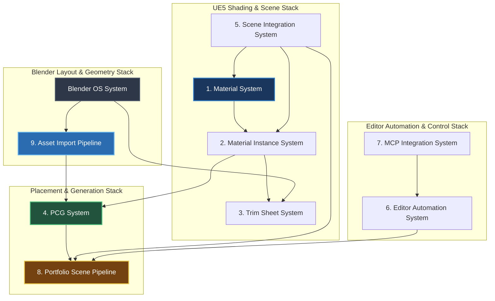

# System Dependency Specification — Environment Portfolio Platform

This document maps out the logical and data dependencies between the subsystems, tracing the critical path of the environment-art production pipeline.

---

## 1. Visual Dependency Map

The diagram below illustrates the hierarchical relationships between the platform's systems. Systems higher in the stack depend directly on the systems below them.



---

## 2. Subsystem Dependency Matrix

This matrix describes the direct coupling between the systems. A value of **Direct** indicates that the dependent system cannot execute or compile if the target system is missing or broken.

| System | Depends On | Dependency Type | Description |
| :--- | :--- | :--- | :--- |
| **2. Material Instance System** | 1. Material System | **Direct** | Requires compiled Master shaders (`M_Master_Toon_Universal`, etc.) to create instances. |
| **3. Trim Sheet System** | 2. Material Instance System | **Direct** | Uses the Layer A/B material blend instances (`MI_Trimsheet_*`) to map textures to vertex color indices. |
| **4. PCG System** | 9. Asset Import Pipeline | **Direct** | Requires imported static mesh collections (`SMC_*`) and modular geometry assets to scatter. |
| | 2. Material Instance System | **Direct** | Scatters meshes that require designated material instances to render stylized shadows correctly. |
| **5. Scene Integration System** | 1. Material System | **Direct** | Uses material parameters collections (`MPC_*`) to drive world lighting and TOD changes. |
| | 2. Material Instance System | **Direct** | Places showcase material spheres and bounds in levels like `L_Template`. |
| **6. Editor Automation System** | 7. MCP Integration System | **Indirect** | Hooks editor menus to socket callbacks triggered by network commands. |
| **8. Portfolio Scene Pipeline** | 9. Asset Import Pipeline | **Direct** | Import manifests must compile modular geometry in the level before scatters execute. |
| | 4. PCG System | **Direct** | Requires PCG volume actors and graphs to place vegetation, rocks, and debris. |
| | 5. Scene Integration System | **Direct** | Requires level environments and master lighting parameters to package renders. |
| **9. Asset Import Pipeline** | 2. Material Instance System | **Direct** | Resolves semantic mesh roles (`large`, `sacred`, `wall`) to material instances using `ROLE_UE_HINTS`. |

---

## 3. Data Dependency Flows

### 3.1 Layout Manifest Data Flow
```
[ Blender Layout Generator ] ──► Generates Mesh FBX and Matrix Transform coordinates
            │
            ▼
[ Manifest JSON Exporter ]  ──► Serializes data into surreal_arch_world_v1 format
            │
            ▼
[ HISM Manifest Importer ]  ──► Parses format, imports FBXs, scales coordinates (Blender -> UE)
            │
            ▼
[ World Outliner ]          ──► Spawns actor, configures HISM components, assigns materials
```

### 3.2 Material Parameter Data Flow
```
[ Preset Specifications ]   ──► Defines parameter floats, vectors, and texture asset paths
            │
            ▼
[ Script Node Compiler ]    ──► Connects node pins and wires parameter expressions programmatically
            │
            ▼
[ Master Shaders ]          ──► Compiles graph structures and registers parameter groups
            │
            ▼
[ Material Instances ]      ──► Overrides default master values with style preset overrides
```

---

## 4. Production Critical Path

To establish a new stylized biome or style scene, the production team must execute tasks along the following critical path:

```
[ 1. Style Research ] ➔ Motifs, proportions, and kit requirements (research/zen/)
         │
         ▼
[ 2. Atom Registry ]  ➔ Register sizes and snaps (architectural_atoms.yaml)
         │
         ▼
[ 3. Kit Assembly ]   ➔ Create and bake Blender modular assets (surreal_architecture_gen.py)
         │
         ▼
[ 4. Material Setup ] ➔ Build shader networks and compile instances (setup_master_*.py)
         │
         ▼
[ 5. Scatter Rules ]  ➔ Build PCG collections and graphs (setup_pcg_*.py)
         │
         ▼
[ 6. Layout Export ]  ➔ Spawn grid plan in Blender and write manifest JSON
         │
         ▼
[ 7. Scene Import ]   ➔ Run HISM importer to place geometry and apply materials in level
         │
         ▼
[ 8. Scatter Spawn ]  ➔ Execute PCG volumes and bake lighting parameters in level
```
